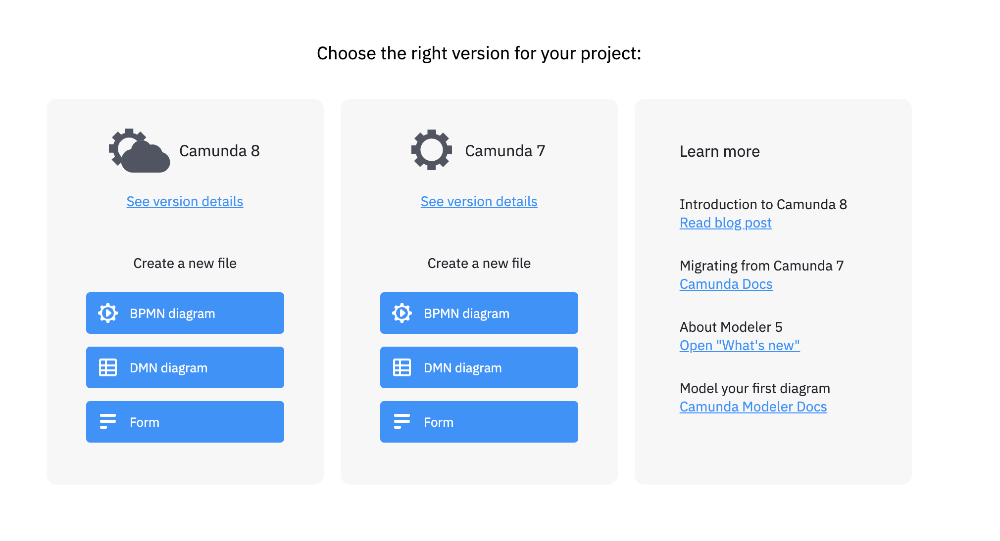

# Getting Started

## Installation

This section describe how to install the basic **components** and **tools** to start developing using **Camunda Workflow Engine**.

### Create Project

In order to create a camunda project, there are **multiple** options to choose from. The simplest options are by using **initializers** that creates java projects with the main **dependencies** and **configuration**.

#### Spring Initializer

[Spring Initializr](https://start.spring.io/) provides an extensible API to **generate** JVM-based projects with implementations for several common components and dependencies.

!!! note

  The **recommendation** is to use **spring initializer** as a base for the project and start adding **Camunda** dependencies on top.

#### Camunda Initializer

Go to camunda initializer [website](https://start.camunda.com/), that allows you to create a **Spring Boot application** with the main dependencies and configuration to start working with Camunda very quickly.

The description of the modules are:

* **REST API**: The goal of the **REST API** is to expose and provide access to all relevant **interfaces** of the engine.
* **WebApps (Cockpit)**: It provides access to **deployed** BPMN processes and DMN decisions, allows **searching** though running and ended **instances** and **performing operations** on these.
* **Spin (XML & JSON)**: Camunda **Spin** is a library for simple XML and JSON processing on the JVM (Java Virtual Machine), targeting Java and JVM-based scripting languages such as Groovy, JRuby, Jython, JavaScript and Java Expression Language. It provides a comprehensible **fluent API** for working with different data formats through lightweight wrapper objects.

### Camunda Modeler

An integrated modeling solution for BPMN, DMN, and Forms based on [bpmn.io](https://bpmn.io/).

You can download the [Open Source Desktop Modeler](https://github.com/camunda/camunda-modeler) from this [url](https://camunda.com/download/modeler/), by selecting the proper O.S.

!!! warning

  You would need to select the proper version from Camunda to start designing the BPMN or DMN models. The current version used in this case is `7.22`.

### IntelliJ

#### Enable Auto-save

Enable following **auto-save** options within **IntelliJ**, to enable auto-formatting and removing unused dependencies when saving.

## Run

### Camunda WebApps

Run the applications and go to **Camunda WebApps** at [http://localhost:8080](http://localhost:8080)

