This section describe how to **install** and **run** the basic **components** and **tools** to start developing using **Camunda Workflow Engine**.

## Create Project

In order to create a camunda project, there are **several** options to choose from. The simplest options are by using **initializers** that creates java projects with the main **dependencies** and **configuration**.

### Spring Initializer

[Spring Initializr](https://start.spring.io/) provides an extensible API to **generate** JVM-based projects with implementations for several common components and dependencies.

!!! note

    The **recommendation** is to use **spring initializer** as a base for the project and start adding **Camunda** dependencies on top. The parent will **inherit** the common plugins and dependencies in **Spring Boot** ecosystem. 

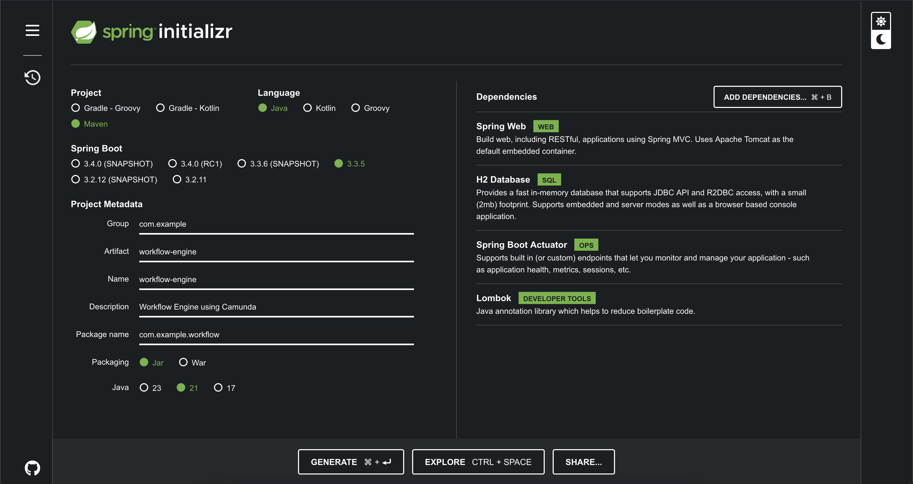

Finally add following dependencies into `pom.xml` file.

!!! note

    Use the proper `camunda.version` to your needs. The current version at this moment is `7.22.0`.

```xml
    <dependencyManagement>
        <dependencies>
            <dependency>
                <groupId>org.camunda.bpm</groupId>
                <artifactId>camunda-bom</artifactId>
                <version>${camunda.version}</version>
                <scope>import</scope>
                <type>pom</type>
            </dependency>
        </dependencies>
    </dependencyManagement>
```

```xml
  <dependencies>
    <!-- Camunda dependencies -->
    <dependency>
        <groupId>org.camunda.bpm.springboot</groupId>
        <artifactId>camunda-bpm-spring-boot-starter-rest</artifactId>
    </dependency>
    <dependency>
        <groupId>org.camunda.bpm.springboot</groupId>
        <artifactId>camunda-bpm-spring-boot-starter-webapp</artifactId>
    </dependency>
    <dependency>
        <groupId>org.camunda.bpm</groupId>
        <artifactId>camunda-engine-plugin-spin</artifactId>
    </dependency>
    <dependency>
        <groupId>org.camunda.spin</groupId>
        <artifactId>camunda-spin-dataformat-all</artifactId>
    </dependency>
  <dependencies>
```

### Camunda Initializer

Go to camunda initializer [website](https://start.camunda.com/), that allows you to create a **Spring Boot application** with the main dependencies and configuration to start working with Camunda very quickly.

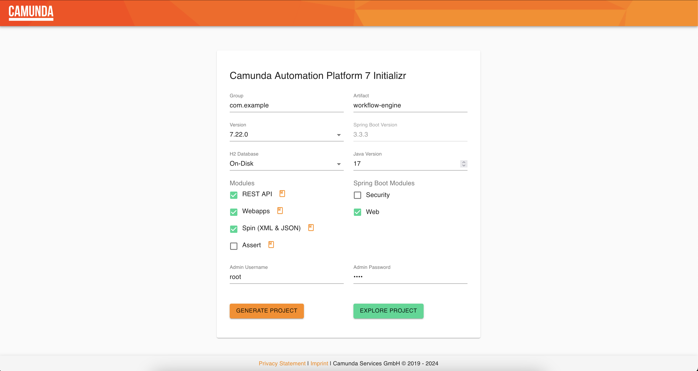

The description of the modules are:

* **REST API**: The goal of the **REST API** is to expose and provide access to all relevant **interfaces** of the engine.
* **WebApps (Cockpit)**: It provides access to **deployed** BPMN processes and DMN decisions, allows **searching** though running and ended **instances** and **performing operations** on these.
* **Spin (XML & JSON)**: Camunda **Spin** is a library for simple XML and JSON processing on the JVM (Java Virtual Machine), targeting Java and JVM-based scripting languages such as Groovy, JRuby, Jython, JavaScript and Java Expression Language. It provides a comprehensible **fluent API** for working with different data formats through lightweight wrapper objects.

### Configuration

Add the configuration needed to run Camunda Engine into `src/main/resources/application.yaml`.

#### Database Configuration

```yaml
spring:
  application:
    name: workflow-engine
  datasource:
    url: jdbc:h2:mem:db
    username: sa
    password: password
    driverClassName: org.h2.Driver
```

#### Camunda Configuration

You can see all Camunda configuration in the [official documentation](https://docs.camunda.org/manual/latest/user-guide/spring-boot-integration/configuration).

```yaml
camunda:
  bpm:
    deployment-resource-pattern: classpath:workflows/**/*.bpmn,classpath:workflows/**/*.dmn,classpath:workflows/**/*.form
    filter:
      # Create a default filter to see all tasks in task list
      create: All tasks
    authorization:
      # Block users from other groups from claiming the task not assigned to it.
      enabled: true
    # https://docs.camunda.org/manual/latest/user-guide/spring-boot-integration/configuration/#generic-properties
    generic-properties:
      properties:
        # Each execution of a model resource (BPMN, DMN, and CMMN) generates historic data during execution
        # that is stored in the database. In Camunda 7, history cleanup removes this historic data from the
        # database based on a defined history time to live (HTTL).
        # https://docs.camunda.io/docs/components/modeler/reference/modeling-guidance/rules/history-time-to-live/
        historyTimeToLive: P30D
        # Expression evaluation is enabled for any query. Use this setting if all users are trusted.
        enableExpressionsInAdhocQueries: true
        enableExpressionsInStoredQueries: true
        # Set Process order policy for Job Execution
        jobExecutorAcquireByDueDate: true
        # jobExecutorAcquireByPriority: true
    job-execution:
      core-pool-size: 3
      max-pool-size: 10
      queue-capacity: 3
      max-jobs-per-acquisition: 3
    admin-user:
      id: admin
      password: password
```

### Workflows

Finally add the following **BPMN** file into `src/main/resources/workflow` with a simple task called `Process Simple`.

```xml
<?xml version="1.0" encoding="UTF-8"?>
<bpmn:definitions xmlns:bpmn="http://www.omg.org/spec/BPMN/20100524/MODEL" xmlns:bpmndi="http://www.omg.org/spec/BPMN/20100524/DI" xmlns:dc="http://www.omg.org/spec/DD/20100524/DC" xmlns:di="http://www.omg.org/spec/DD/20100524/DI" xmlns:camunda="http://camunda.org/schema/1.0/bpmn" id="Definitions_0fr9mxs" targetNamespace="http://bpmn.io/schema/bpmn" exporter="Camunda Modeler" exporterVersion="5.28.0">
  <bpmn:process id="process-simple" name="Process Simple" isExecutable="true" camunda:historyTimeToLive="180">
    <bpmn:startEvent id="StartEvent_1">
      <bpmn:outgoing>SequenceFlow_1fp17al</bpmn:outgoing>
    </bpmn:startEvent>
    <bpmn:sequenceFlow id="SequenceFlow_1fp17al" sourceRef="StartEvent_1" targetRef="say-hello" />
    <bpmn:endEvent id="EndEvent_0x6ir2l">
      <bpmn:incoming>SequenceFlow_16gzt2m</bpmn:incoming>
    </bpmn:endEvent>
    <bpmn:sequenceFlow id="SequenceFlow_16gzt2m" sourceRef="say-hello" targetRef="EndEvent_0x6ir2l" />
    <bpmn:userTask id="say-hello" name="Say hello to&#10;demo" camunda:candidateUsers="demo">
      <bpmn:incoming>SequenceFlow_1fp17al</bpmn:incoming>
      <bpmn:outgoing>SequenceFlow_16gzt2m</bpmn:outgoing>
    </bpmn:userTask>
  </bpmn:process>
  <bpmndi:BPMNDiagram id="BPMNDiagram_1">
    <bpmndi:BPMNPlane id="BPMNPlane_1" bpmnElement="process-simple">
      <bpmndi:BPMNShape id="_BPMNShape_StartEvent_2" bpmnElement="StartEvent_1">
        <dc:Bounds x="179" y="99" width="36" height="36" />
      </bpmndi:BPMNShape>
      <bpmndi:BPMNShape id="EndEvent_0x6ir2l_di" bpmnElement="EndEvent_0x6ir2l">
        <dc:Bounds x="432" y="99" width="36" height="36" />
      </bpmndi:BPMNShape>
      <bpmndi:BPMNShape id="UserTask_08mft2c_di" bpmnElement="say-hello">
        <dc:Bounds x="270" y="77" width="100" height="80" />
      </bpmndi:BPMNShape>
      <bpmndi:BPMNEdge id="SequenceFlow_1fp17al_di" bpmnElement="SequenceFlow_1fp17al">
        <di:waypoint x="215" y="117" />
        <di:waypoint x="270" y="117" />
      </bpmndi:BPMNEdge>
      <bpmndi:BPMNEdge id="SequenceFlow_16gzt2m_di" bpmnElement="SequenceFlow_16gzt2m">
        <di:waypoint x="370" y="117" />
        <di:waypoint x="432" y="117" />
      </bpmndi:BPMNEdge>
    </bpmndi:BPMNPlane>
  </bpmndi:BPMNDiagram>
</bpmn:definitions>
```

The **diagram** of previous **BPMN** process is the following.

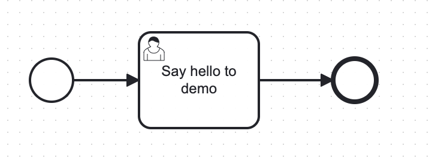

## Modeler

**Camunda Modeler** is an integrated modeling solution for **BPMN**, **DMN**, and **Forms** based on [bpmn.io](https://bpmn.io/).

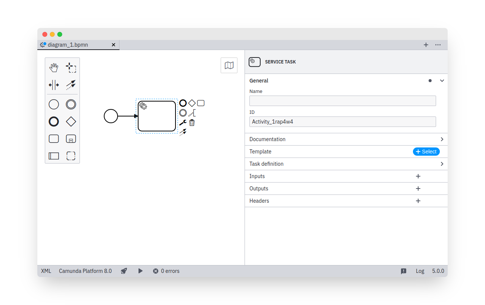

You can download the [Open Source Desktop Modeler](https://github.com/camunda/camunda-modeler) from this [url](https://camunda.com/download/modeler/), by selecting the proper O.S.

!!! warning

    You would need to select the **proper** version of **Camunda** to start designing the BPMN or DMN models. 

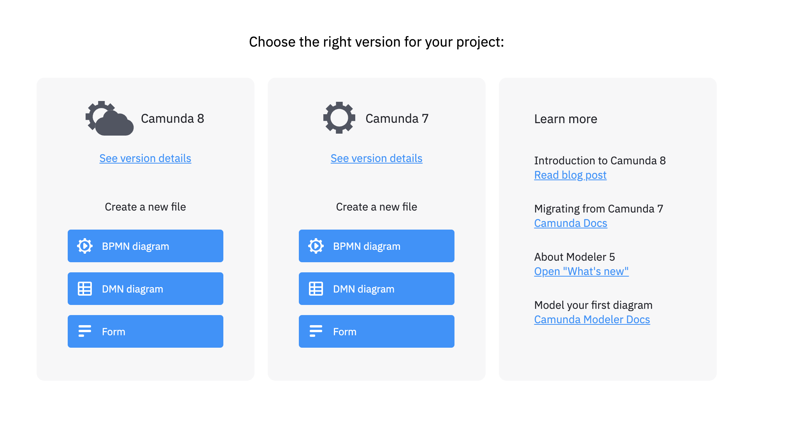

## WebApps

Run the application and go to **Camunda WebApps** at [http://localhost:8080](http://localhost:8080)

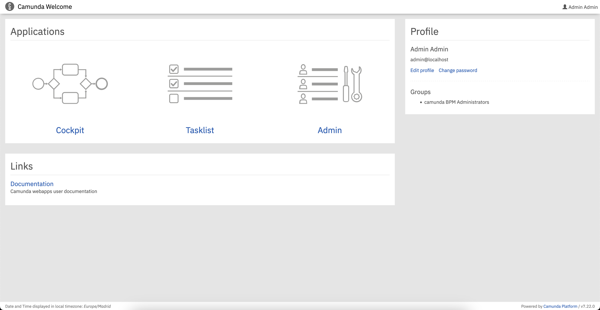

For specific webapp use following links:

* [Cockpit Dashboard](http://localhost:8080/camunda/app/cockpit/default/#/dashboard)
* [TaskList Dashboard](http://localhost:8080/camunda/app/tasklist/default/)

### Tasklist

To manually start a process go to [TaskList Dashboard](http://localhost:8080/camunda/app/tasklist/default/).

Click to **Start process** button on the top-right corner of the screen.

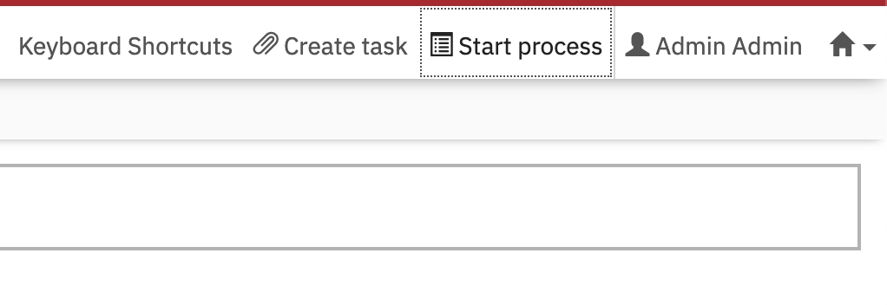

**Select** the workflow (`Process Simple`) to be started among the deployed ones.

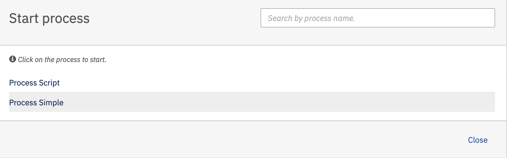

Set a **Business Key** to identify the process and finally click **Start**.

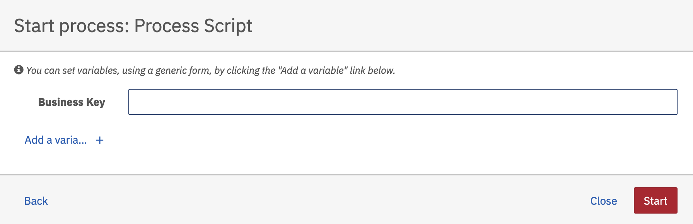

This will start a **process instance**. Since it's a simple process with an *User Task*, this will be listed in the tasklist, so press `F12` or reload the page to **refresh** the current webpage. You **cannot complete** it until the task will be **assigned** to an user or **claimed**.

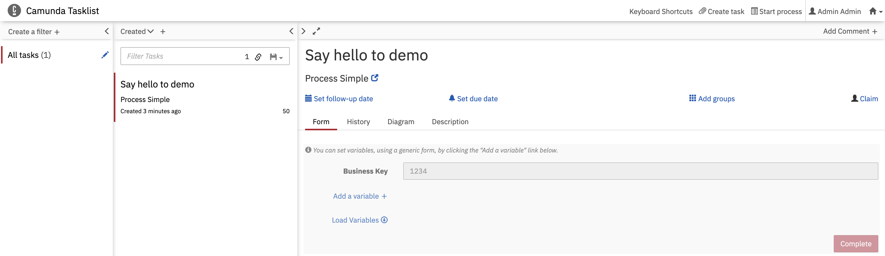

Once you (claim) or somebody else have been assigned to the task, it can be **completed**.

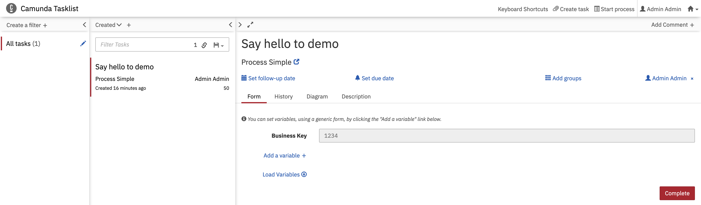

### Cockpit

**Cockpit** gives you a *real-time* view of BPMN processes and DMN decision tables as they run, so you can monitor their status and quickly identify technical incidents that slow down or stop workflows.

!!! note

    Cockpit will **only** show the **current** process instances being running, for the historical processes you must **upgrade** to the Enterprise Camunda version.

From the previous example, the process is still running and the *User Task* is still pending to be completed. You can visualize this information within the cockpit.

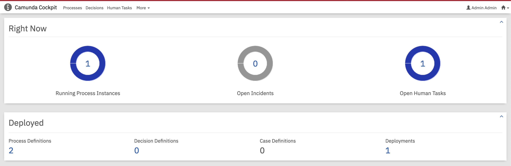

In the **Running Process Instances** options, you can see the definition version, definition key and name, history time to live (HTTL), process instances (Current Step, start time, Business Key), incidents, job definitions.

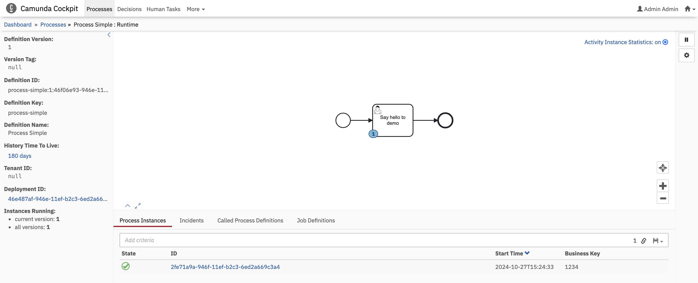

In process instances you can take a look closer to the process running, variables, user tasks, etc..

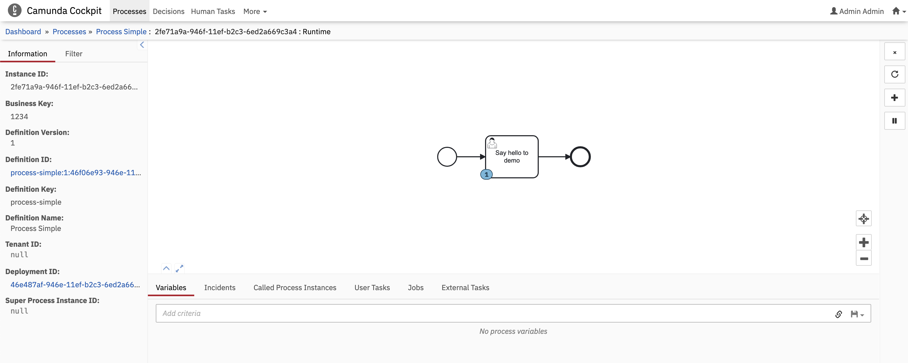

In the **Open Human Tasks** options, you can visualize a resume for all **assignments** by type and group for all processes.

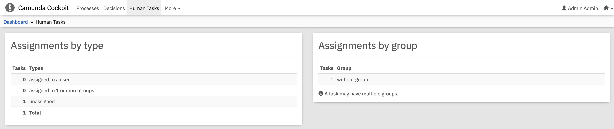

## IDE

### IntelliJ

#### Enable Auto-save

Enable following **auto-save** options within **IntelliJ**, to enable auto-formatting and removing unused dependencies when saving.

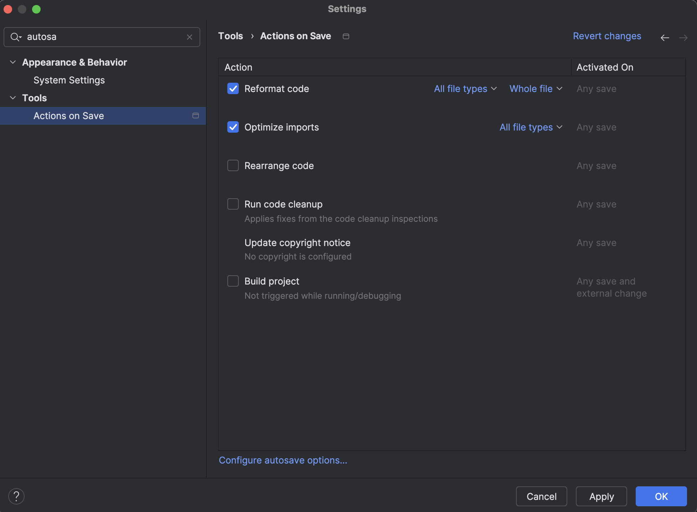
