## Policy Process

### BPMN

**Business Process Model and Notation (BPMN 2.0)** was developed as a **graphical notation** to **represent complex processes** and address these challenges. The visual nature of BPMN enables **greater collaboration** between different teams.

The [policy process](process-dmn.bpmn) is a more complex BPMN process that consist on several **User Tasks**, **Script Tasks**, **Call Activity** (subprocess) and multiple **Gateways** and **boundary events**.

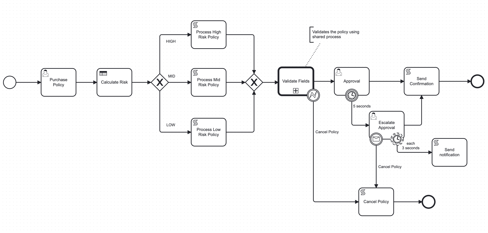

=== "Process"

    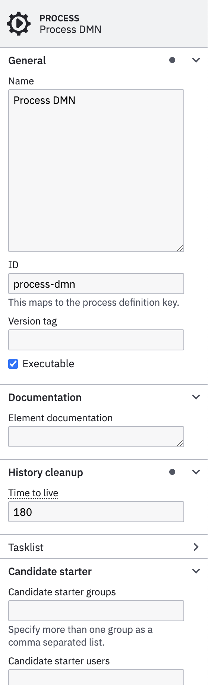{ width="250" align=left }

    In the **Process** tab you have to configure the **Name** and **ID** of the process.

    !!! note

        You must select in an **empty area** of the **Camunda Modeler** to get the process properties.

    This process can be used as **standalone** or **invoked** by other processes as **Call Activity** (subprocess). In this case this is the **main process**, so other processes will be **executed** from this one. 

    Another important configuration if the _**Historical Time to live (HTTL)**_, the _**Candidate starter groups**_ and _**Candidate starter users**_ that will be able to interact with this process.

=== "User Task"

    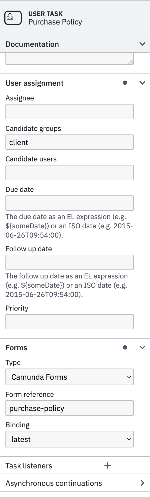{ width="250" align=left }

    **User Tasks** are tasks that need **user interaction** to be able to **continue** with the **process**. When an user task is **completed**, the task may need additional **variables** to be submitted into the flow (`Forms`). These **variables** can be used for following tasks to perform **automatic tasks** such as validations, data persist operations or be used by **conditionals** based on **gateways** or **rule engines (DMN)**.

    User tasks allows to configure the assignments based on following properties:

    * **Assignee**: the **user** that must **complete** the tasks
    * **Candidate groups**: Comma separated values with the **groups** or profiles **allowed** to claim the task.
    * **Candidate users**: Comma separated values with the **users** **allowed** to claim the task.
    * **Due date**: Due date to **complete** the task, otherwise the task will be cancelled.

    In order to get variables to be submitted into the process, Camunda allow to configure `Forms` directly into the tasks.

    * **Type**: Type of Form supported by Camunda: `Camunda Forms`, `Embedded or External Tasks Forms` or `Generated Task Forms`.
    * **Form reference**: the form identifier (`ID`) used when creating the `Camunda Form`.
    * **Binding**: The version of the form used: `deployment`, `latest`, `version`.

=== "DMN"

    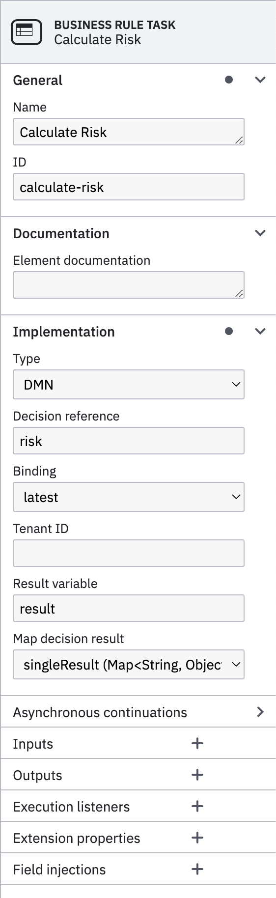{ width="250" align=left }

    The **Business Rule Task** allow to set a business logic (`conditions`) to **generate** results (`outputs`) based on **variables** (`inputs`) from the current process.

    * **Type**: Types of implementations that can be used: **DMN**, **External**, **Java Class**, **Expression**, etc.. 
    * **Decision reference**: In the case of using **DMN**, the decision table to be used to compute the business rules.
    * **binding**: The version of the form used: `deployment`, `latest`, `version`, `versionTag`.
    * **Result variable**: The name of the variable with the result (`output`).
    * **Map decision result**: Depending on the result to return or the `Hit Policy` using DMN, it can return multiple occurrences. For that Camunda allow the following types:  `singleResult (Map<String,Object>)`, `resultList (List<Map<String,Object>>)`, `singleEntry (TypedValue)`, `collectEntries (List<Object>)`.

=== "Sequence Flow"

    { width="250" align=left }

    By using **conditional gateways** (**Exclusive Gateway**), you can **control** the sequence **depending** on **conditions**. Those **conditions** are **computed** by the **Sequence Flow**, that are the arrows that are connected to the conditional gateway.

    In order to set the condition, you must configure following properties:

    * **Type**: You can choose between `Script` or `Expression` to specify the condition.
    * **Condition Expression**: In the case of using `Script`, you can use following script to check for a particular condition: `${result.risk == "HIGH"}`

=== "Process Sequence"

    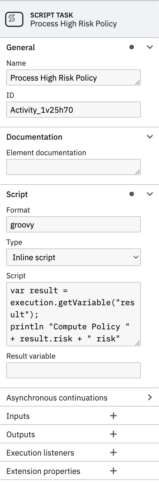{ width="250" align=left }

    This is an **automatic task** that support scripting. There are several [scripting languages](https://docs.camunda.org/manual/7.22/user-guide/process-engine/scripting/) supported by Camunda. You would need to add dependencies to support various languages into the Camunda project.

    In order to support **groovy** scripting language to will need to add following dependency into `pom.xml` file.

    ```xml
      <dependency>
          <groupId>org.codehaus.groovy</groupId>
          <artifactId>groovy-jsr223</artifactId>
          <version>${groovy-jsr.version}</version>
          <scope>compile</scope>
      </dependency>
    ```

    In order to properly configure a Script Task you will need to select:

    * **Format**: The format of your scripting language: `groovy`, `javascript`, `python`, etc..
    * **Type**: There are two options `Inline script` or `External Resource`
    * **Script/External Resource**: Depending on the `Type` selected you must put down your script or reference an external file.

    Following **groovy** script will extract the variable `result` generated by the **Business Rule Task (DMN)** and print a message into the console, with the `risk` attribute.

    ```groovy
    var result = execution.getVariable("result");
    println "Compute Policy " + result.risk + " risk"
    ```

=== "Call Activity"

    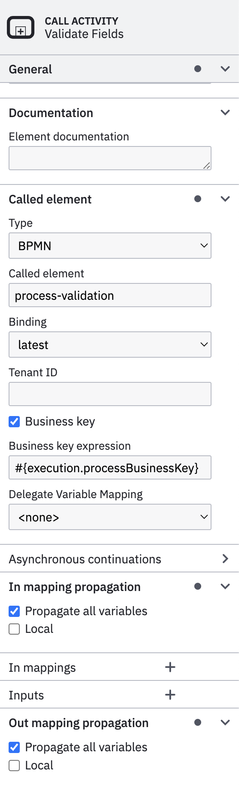{ width="250" align=left }

    **Call Activity** allows to call a **subprocess** modeled into a different file. This allows to **share processes** instead creating embedded subprocesses in the same file.

    In order to properly configure a `Call Activity`, you must set following properties into `Called Element`:

    * **Type**: Call activity could be either `BPMN` or `CMMN` subprocess.
    * **Called element**: The reference of the called element or subprocess `ID`.
    * **Binding**: The version of the form used: `deployment`, `latest`, `version`, `versionTag`.
    * **Business Key**: Allow to propagate the same `Business Key` to the subprocess being called.

    In order the **subprocess** and **parent** share the **same variables** ensure to **check** following properties.

    * `Propagate all variables` in `In Mapping Propagation`
    * `Propagate all variables` in `Out Mapping Propagation`

=== "Error Event"

    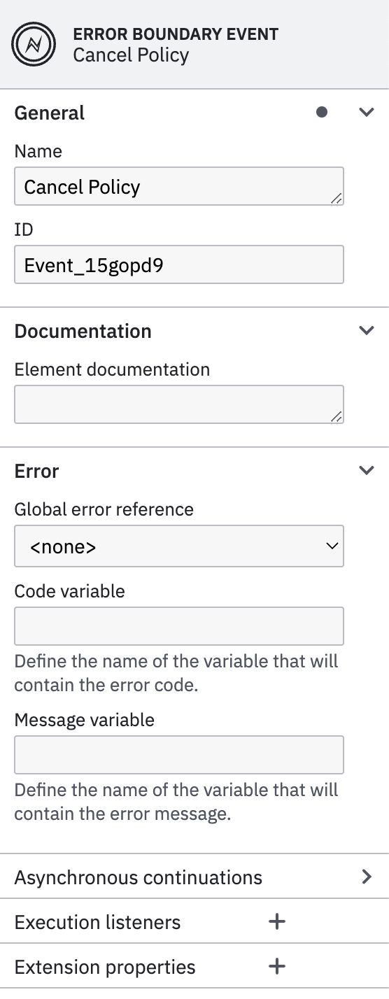{ width="250" align=left }

    **Boundary events** provide a way to model what should happen if an event occurs while an activity is still **active**.

    A **boundary event** must be an **intermediate** catch event, and can be either **interrupting** or **non-interrupting**. **Interrupting** means that once triggered, before taking any outgoing sequence flow the activity the event is attached to is terminated. This allows modeling timeouts where we can prune certain execution paths if something happens (e.g. the process takes too long).

    You can add as many as needed **Boundary events** to a Task (Service Task, User Task, Script Task, etc..).

    There are multiple [options supported](https://docs.camunda.io/docs/components/modeler/bpmn/events/) in BPMN like **Message Events**, **Signal Events**, **Timer Events**, **Error Events**, **Escalation Events**, etc..

    In BPMN, errors define possible errors that can occur. Error events are elements in the process referring to defined errors. An error can be referenced by one or more error events. An error must define an `errorCode`. The value of this `errorCode` is used to determine which catch event can catch the thrown error.

    !!! note

        In the example this Error Boundary Event will catch any error thrown by the **Child Task (subprocess)**, so it won't take into consideration the `errorCode` of the exception so it catches **all thrown errors**.

=== "Notification"

    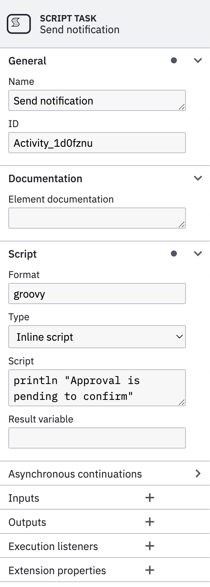{ width="250" align=left }

    This is a **Script Task** that only print an **output log** into the **console**.

    ```groovy
    println "Approval is pending to confirm"
    ```

=== "Escalation"

    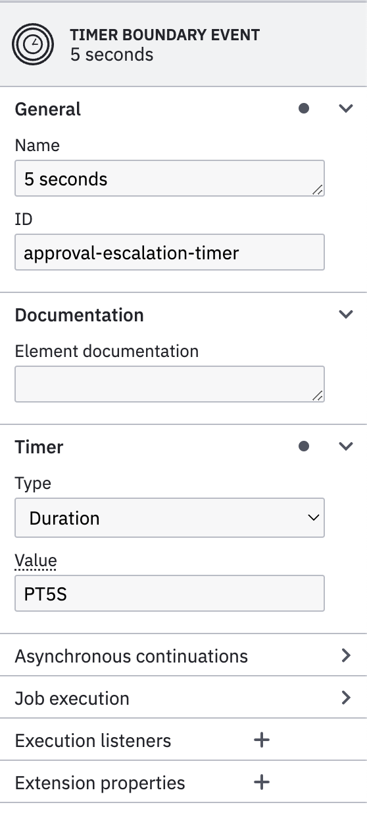{ width="250" align=left }

    **Timer Boundary Event** can be either **interrupting** or **non-interrupting**, in this case it is **Interrupting**. **Interrupting** means once is triggered the flow changes **breaking** the normal flow. The **non-interrupting** boundary events has dotted lines and the **interrupting** not.

    In order to properly configure **Timer Boundary Event** you will need to set following properties:

    * **Type**: You can select between three different types: `Date`, `Duration` and `Cycle`.
    * **Value**: The time value depending on the type. For the duration and date it uses [ISO 8601](https://en.wikipedia.org/wiki/ISO_8601) time format (i. `PT5S`, `R/PT3S`)

=== "Reminder"

    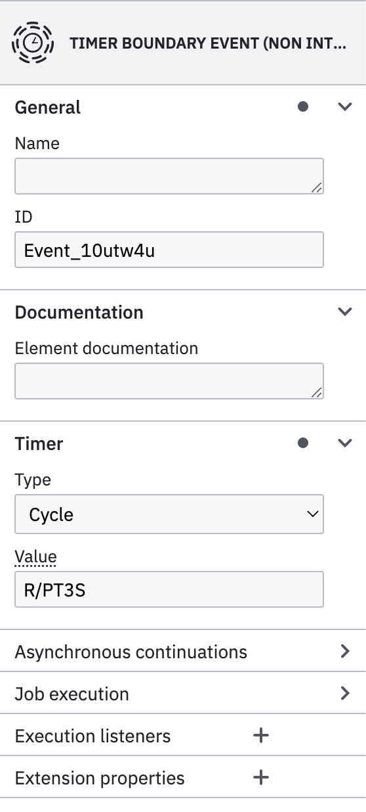{ width="250" align=left }

    **Timer Boundary Event** can be either **interrupting** or **non-interrupting**, in this case it is **non-interrupting**. **Non-interrupting** means once is triggered the flow does not change the normal flow, instead it will run in parallel the secondary flow while it's **waiting** for the main task to be **completed**. The **non-interrupting** boundary events has dotted lines and the **interrupting** not.

    In order to properly configure **Timer Boundary Event** you will need to set following properties:

    * **Type**: You can select between three different types: `Date`, `Duration` and `Cycle`.
    * **Value**: The time value depending on the type. For the duration and date it uses [ISO 8601](https://en.wikipedia.org/wiki/ISO_8601) time format (i. `PT5S`, `R/PT3S`)

=== "Cancel Event"

    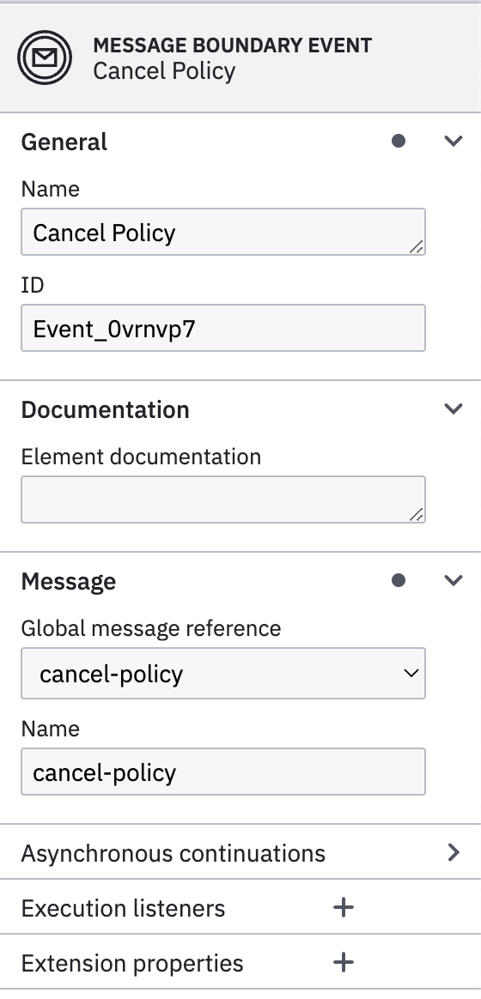{ width="250" align=left }

    **Message Boundary Event** can be either **interrupting** or **non-interrupting**, in this case it is **Interrupting**. **Interrupting** means once is triggered the flow changes **breaking** the normal flow. The **non-interrupting** boundary events has dotted lines and the **interrupting** not.

    In order to properly configure **Message Boundary Event** you will need to set following properties for the Message:

    * **Global Message reference**: the message reference to be **subscribed** on. If the event does not exist it must be created.
    * **Name**: The name of the message event.

    Once **Boundary Event** receives a message using that message `name` and the `Business Key`, it will be **triggered** so the normal flow will break.

=== "Confirmation"

    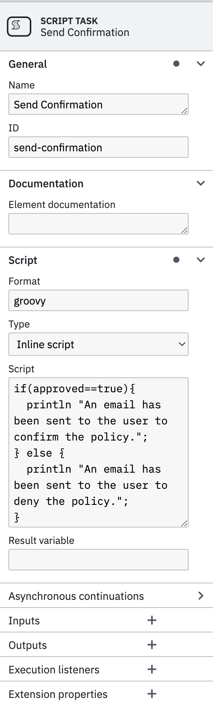{ width="250" align=left }

    This is a **Script Task** that checks if `approved` is `true` to confirm the policy.

    This is the script to be **evaluated**.

    ```groovy
    if(approved==true){
      println "An email has been sent to the user to confirm the policy.";
    } else {
      println "An email has been sent to the user to deny the policy.";
    }
    ```

### Forms

Forms can be modeled using **Camunda Modeler**. You can add as many **elements** to the **form** and binding to **variables** that will be **submitted** to the process when the task is **completed**.

!!! warning

    Using **Camunda Forms** may not fit with the **web framework** or **styles** you are currently using. Because of that, you should **create** your own **forms** and bind them to the tasks by using proper identifiers.

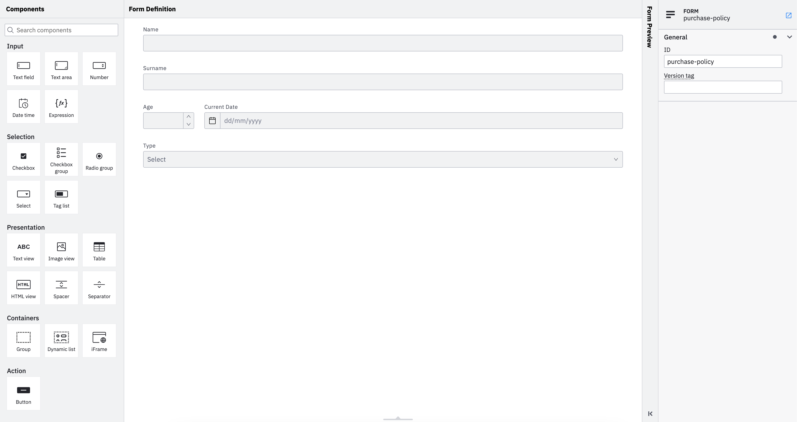

### DMN

**DMN stands for Decision Model and Notation**. It is a **standard** administered by the **Object Management Group (OMG)** and has been widely adopted across various industries. Businesses leverage **DMN** to design **decision models** that are used for **automation** of the **decision-making** processes. DMN serves as a common language to **align business and IT** on repeatable **business rules** and **decision management**. The notation enhances business efficiency, reduces the risk of human error, and ensures that decision models are interchangeable across the organization.

Core elements of DMN include:

* **Decision tables**: Simple and intuitive **representation** of decisions consisting of **input**, **condition**, and **output**.
* **Friendly Enough Expression Language (FEEL)**: Used to **express conditions** in the decision tables so they can be executed.
* **Decision Requirements Diagrams (DRD)**: Created when a decision **can not be described in just one simple table**. For example, when there are dependencies between intermediate decisions output from which serve as an input for the final decision to be made.

The example [process dmn](process-dmn.dmn) consist in **one decision** table and **two inputs**, there is no additional **DRD** or **functions**.

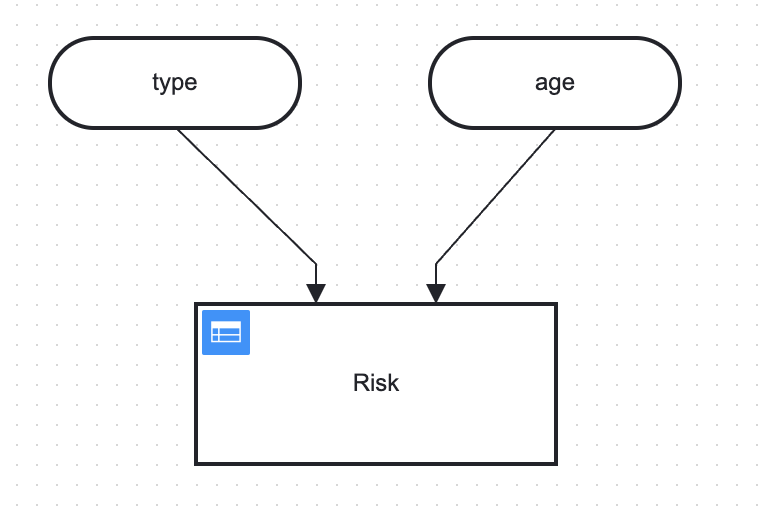{ width="500" }

=== "Decision Table"

    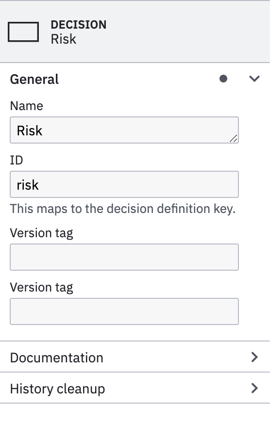{ width="250" align=left }

    A **decision table** represents **decision logic** which can be depicted as a table in **DMN**. It consists of **inputs**, **outputs** and **rules**. Decision Tables can be **chained** by creating a **Decision Requirements Diagrams (DRD)**

    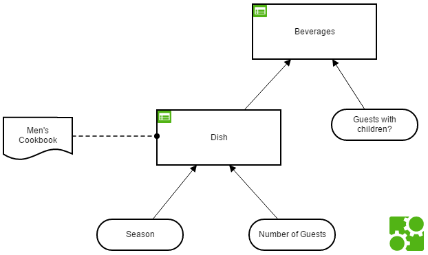{ width="400" }

    In the configuration tab **Name** and ID must be specified for the **DMN**.

=== "Inputs"

    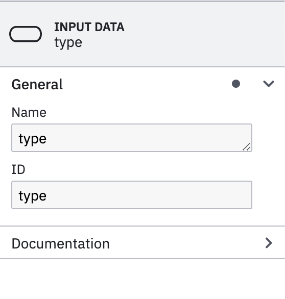{ width="250" align=left }
    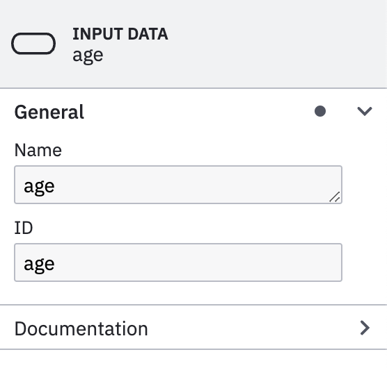{ width="250" align=left }

    Inputs must be **named** in the **same way** as the variables from the **process** (i.e `type`, `age`).

    Later these **inputs** can be **referenced** in the Decision Table as an **Expressions**. This way it makes more **explicit** the **inputs** used for each Decision Table from the **DMN**

A **decision table** consists of **several rules**, typically represented as **rows**. When reading such a row, we look at certain **input values** and **deduct** a certain **result** represented by **output values**.

**Hit policies** describe different ways (standardized by DMN) to **evaluate** the rules contained in a decision table. **Different** hit policies do not only **lead** to **different results**, but typically also **require** different modes of thinking and reason about the meaning of the entire table. For example, When using the simplest hit policy "unique" or "first", such rules **do not overlap**: only a **single rule** must match.

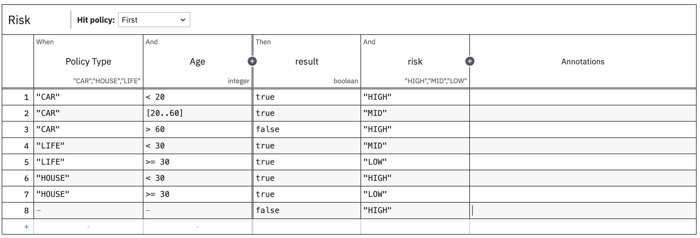

=== "Inputs"

    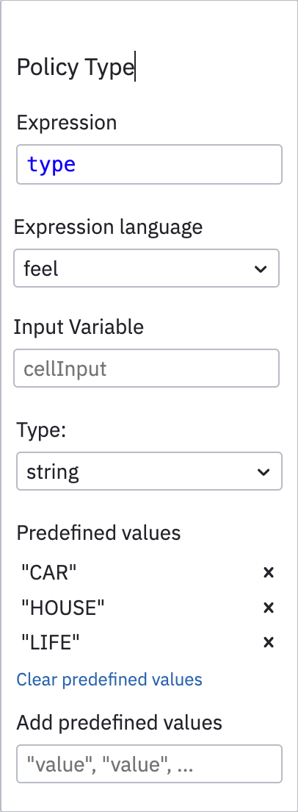{ width="250" align=left }  

    Depending if you are defining de **inputs** in the **DRD**, you can use an **Expression** or use **Input Variable** instead.

    { width="350" }

    So, if you already have an **input data** named `type` you can use the **same value** for the **expression**. However if you **don't have** defined any **input data** to your ** **, then you must use **Input Variable** with the variable `type`.
    
    !!! note
    
        It's **best practice** to use **inputs** from **expressions** rather than **row inputs**, since you can watch all inputs be seeing the **DRD**.

    Using `string` types you can define **predefined values** (aka *enumerations*) in order to restrict possible values to choose from.

=== "Edit"

    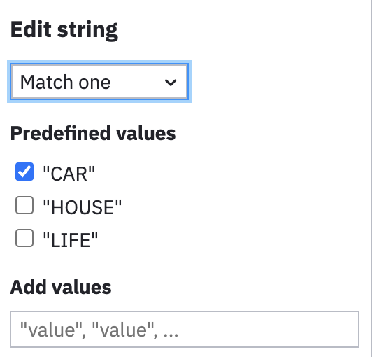{ width="250" align=left }
    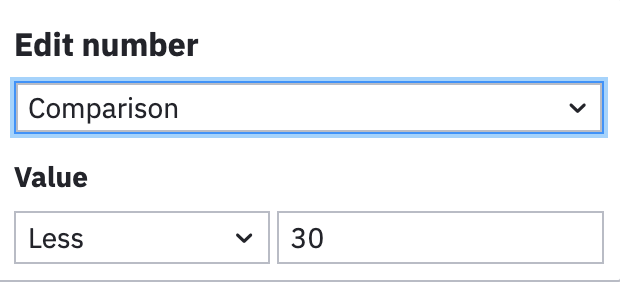{ width="250" align=left }

    Depending on  you input **types** you can select the **condition** to evaluate (`Match one`, `Comparison`) and the values to **compare with** (`CAR`,`< 30`). 

=== "Outputs"

    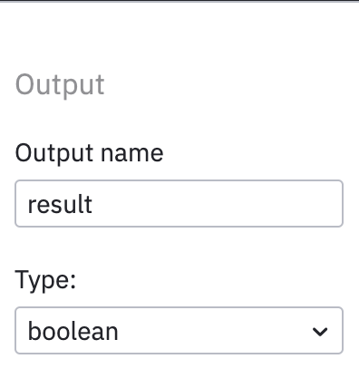{ width="250" align=left }

    For the out put you must decide the **type** of the output and the **value** for each row. 
    
    You can have **multiple** outputs returned in the final result.

The final **result** from the **DMN** will be used by flow and for the [validation process](workflow-example.md#validation-process) with the following `json` format.

```json
{
  "result": true,
  "risk": "MID"
}
```

## Validation Process

The [validation process](process-validation.bpmn) consist in one automatic task (`Script Task`) that checks whether the **result** from previous operation was **successful**. Otherwise, it will **throw an exception** that terminates the subprocess with an **error**. This error will be **caught** by the **parent process** in order to perform an action.

Following is the structure of the **result** from the [DMN Task](workflow-example.md#dmn)

```json
{
  "result": true,
  "risk": "MID"
}
```

The **BPMN model** of the validation process is the **following**.

!!! note

    The process bellow have a **Debug** User Task so it will be **easier** to debug and **watch** variables, since it will stop the flow at that stage. **You will need to remove it at the end**.

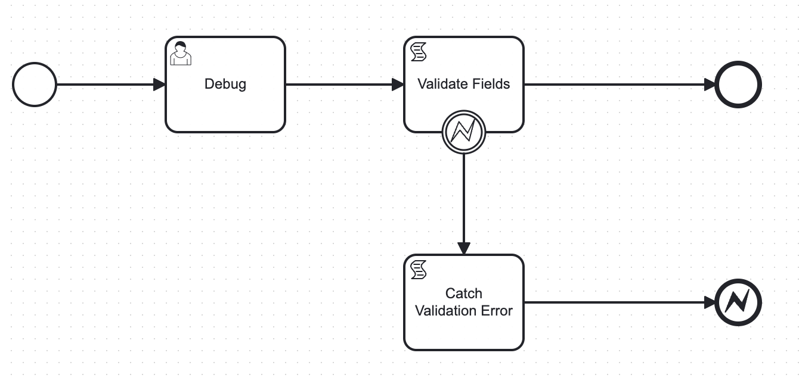{ width="700" }

=== "Process"

    { width="250" align=left }

    In the **Process** tab you have to configure the **Name** and **ID** of the process.

    !!! note

        You must select in an **empty area** of the **Camunda Modeler** to get the process properties.

    This process can be used as **standalone** or **invoked** by other processes as **Call Activity** (subprocess). In this case the **ID** of the process will be used to be referenced from other processes. 

    Another important configuration if the _**Historical Time to live (HTTL)**_, the _**Candidate starter groups**_ and _**Candidate starter users**_ that will be able to interact with this process.

=== "Validate Task"

    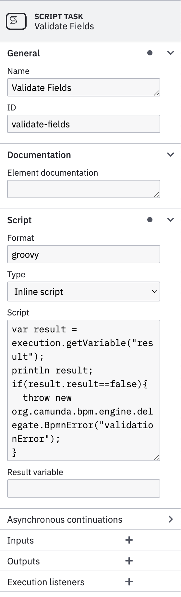{ width="250" align=left }

    This is an **automatic task** that support scripting. There are several [scripting languages](https://docs.camunda.org/manual/7.22/user-guide/process-engine/scripting/) supported by Camunda. You would need to add dependencies to support various languages into the Camunda project.

    In order to support **groovy** scripting language to will need to add following dependency into `pom.xml` file.

    ```xml
      <dependency>
          <groupId>org.codehaus.groovy</groupId>
          <artifactId>groovy-jsr223</artifactId>
          <version>${groovy-jsr.version}</version>
          <scope>compile</scope>
      </dependency>
    ```

    In order to properly configure a Script Task you will need to select:

    * **Format**: The format of your scripting language: `groovy`, `javascript`, `python`, etc..
    * **Type**: There are two options `Inline script` or `External Resource`
    * **Script/External Resource**: Depending on the `Type` selected you must put down your script or reference an external file.

    Following **groovy** script will throw an **exception** if the result from a process variable (input of the process) is `false`.

    ```groovy
    var result = execution.getVariable("result");
    println result;
    if(result.result==false){
      throw new org.camunda.bpm.engine.delegate.BpmnError("validationError");
    }
    ```

    The exception will **trigger** the **Error Boundary**, so it will **exit** the **normal** path of the flow.

=== "Error Boundary"

    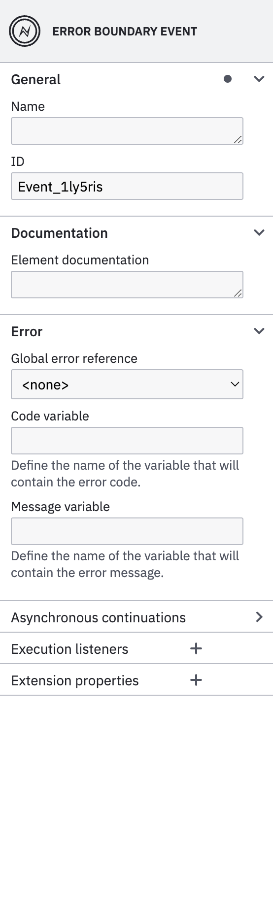{ width="250" align=left }

    **Boundary events** provide a way to model what should happen if an event occurs while an activity is still **active**.

    A **boundary event** must be an **intermediate** catch event, and can be either **interrupting** or **non-interrupting**. **Interrupting** means that once triggered, before taking any outgoing sequence flow the activity the event is attached to is terminated. This allows modeling timeouts where we can prune certain execution paths if something happens (e.g. the process takes too long).

    You can add as many as needed **Boundary events** to a Task (Service Task, User Task, Script Task, etc..).

    There are multiple [options supported](https://docs.camunda.io/docs/components/modeler/bpmn/events/) in BPMN like **Message Events**, **Signal Events**, **Timer Events**, **Error Events**, **Escalation Events**, etc..

    In BPMN, errors define possible errors that can occur. Error events are elements in the process referring to defined errors. An error can be referenced by one or more error events.

    An error must define an `errorCode`. The value of this `errorCode` is used to determine which catch event can catch the thrown error.

    For error throw events, it is possible to define the `errorCode` as an expression or a static value. If an `errorCode` expression is configured then it will be evaluated once the event is reached, and used to throw error.

    For error catch events `errorCode` must be a static value. Alternatively an error catch event may omit the error reference all together. In this case it catches all thrown errors.

    !!! note

        In the example this Error Boundary Event will catch any error thrown by the Task, so it won't take into consideration the `errorCode` of the exception so it catches **all thrown errors**.

=== "Validation Error"

    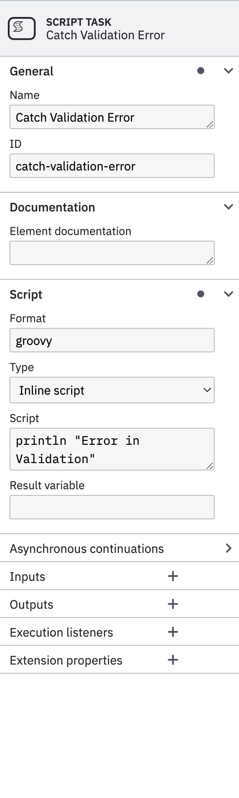{ width="250" align=left } 

    This is a **Script Task** will only prints an **output log** into the **console**.

    ```groovy
    println "The Policy has been cancelled"
    ```

    You can also get the **error code** or **message** thrown by previous *error boundary event*.

=== "Error Event"

    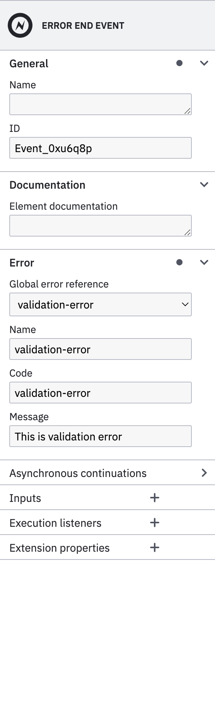{ width="250" align=left }

    In a process you can define **End Events** that will be used later by the parent process and caught by the corresponding **Boundary Events**. Similar when an exception is thrown by the system or a task, you can throw a **typed exception** at the end of the process using **Error End Events**.

    Following an example of a **Call Activity** that will catch an exception from a subprocess and **react** accordingly.

    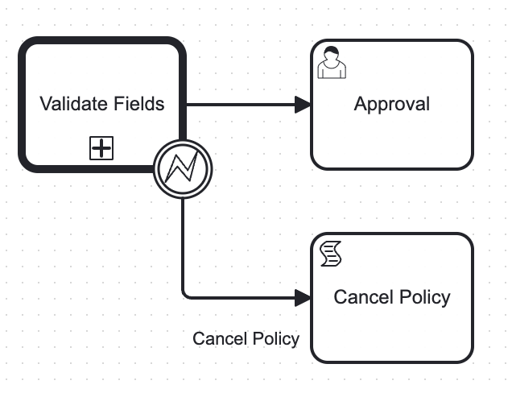{ width="350" }

    The common parameters to be configured using ***Error End Event*** are:

    * **Global error reference**: The reference of the error to be thrown. You can create a new one if it does not exist.
    * **Name**: The `name` of the error.
    * **Code**: The `errorCode` of the exception to be caught by a **Boundary Event**
    * **Message**: Message of the exception to be thrown.
