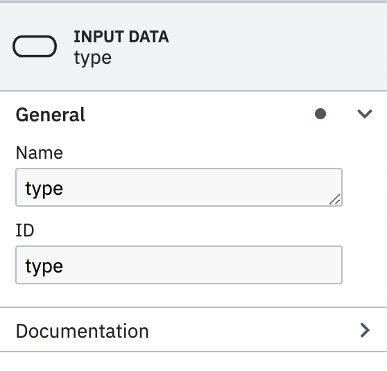
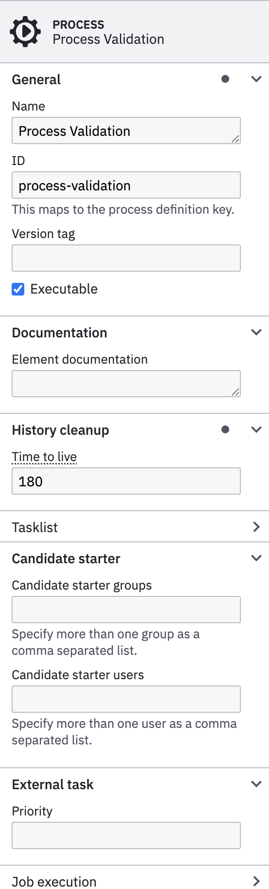

# Example

## Policy Process

### BPMN


### DMN

{ width="500" }

=== "Decision"

    { width="250" align=left }

=== "Input Type"

    { width="250" align=left }

=== "input Age"

    { width="250" align=left }


=== "Inputs"

    { width="250" align=left }

=== "Edit"

    { width="250" align=left }
    { width="250" align=left }

=== "Outputs"

    { width="250" align=left }

## Validation Process

!!! note

    The process bellow have a **Debug** User Task so it will be **easier** to debug and **watch** variables, since it will stop the flow at that stage. **You will need to remove it at the end**.

{ width="700" }

=== "Process"

    { width="250" align=left }

    In the **Process** tab you will have to configure the **Name** and **ID** of the process.

    !!! note

        Yoy will have to select in an **empty area** of the **Camunda Modeler** to get the process properties.

    This process can be used as **standalone** or **invoked** by other processes as **Call Activity** (subprocess). In this case the **ID** of the process will be used to be referenced from other processes. 

    Another important configuration if the _**Historical Time to live (HTTL)**_, the _**Candidate starter groups**_ and _**Candidate starter users**_ that will be able to interact with this process.

=== "Validate Task"

    { width="250" align=left }

    This is an **automatic task** that support scripting. There are several [scripting languages](https://docs.camunda.org/manual/7.22/user-guide/process-engine/scripting/) supported by Camunda. You would need to add dependencies to support various languages into the Camunda project.

    In order to support **groovy** scripting language to will need to add following dependency into `pom.xml` file.

    ```xml
      <dependency>
          <groupId>org.codehaus.groovy</groupId>
          <artifactId>groovy-jsr223</artifactId>
          <version>${groovy-jsr.version}</version>
          <scope>compile</scope>
      </dependency>
    ```

    In order to properly configure a Script Task you will need to select:

    * **Format**: The format of your scripting language: `groovy`, `javascript`, `python`, etc..
    * **Type**: There are two options `Inline script` or `External Resource`
    * **Script/External Resource**: Depending on the `Type` selected you must put down your script or reference an external file.

    Following **groovy** script will throw an **exception** if the result from a process variable (input of the process) is `false`.

    ```groovy
    var result = execution.getVariable("result");
    println result;
    if(result.result==false){
      throw new org.camunda.bpm.engine.delegate.BpmnError("validationError");
    }
    ```

    The exception will **trigger** the **Error Boundary**, so it will **exit** the **normal** path of the flow.

=== "Error Boundary"

    { width="250" align=left }

    **Boundary events** provide a way to model what should happen if an event occurs while an activity is still **active**.

    A **boundary event** must be an **intermediate** catch event, and can be either **interrupting** or **non-interrupting**. **Interrupting** means that once triggered, before taking any outgoing sequence flow the activity the event is attached to is terminated. This allows modeling timeouts where we can prune certain execution paths if something happens (e.g. the process takes too long).

    You can add as many as needed **Boundary events** to a Task (Service Task, User Task, Script Task, etc..).

    There are multiple [options supported](https://docs.camunda.io/docs/components/modeler/bpmn/events/) in BPMN like **Message Events**, **Signal Events**, **Timer Events**, **Error Events**, **Escalation Events**, etc..

    In BPMN, errors define possible errors that can occur. Error events are elements in the process referring to defined errors. An error can be referenced by one or more error events.

    An error must define an `errorCode`. The value of this `errorCode` is used to determine which catch event can catch the thrown error.

    For error throw events, it is possible to define the `errorCode` as an expression or a static value. If an `errorCode` expression is configured then it will be evaluated once the event is reached, and used to throw error.

    For error catch events `errorCode` must be a static value. Alternatively an error catch event may omit the error reference all together. In this case it catches all thrown errors.

    !!! note

        In the example this Error Boundary Event will catch any error thrown by the Task, so it won't take into consideration the `errorCode` of the exception so it catches **all thrown errors**.

=== "Error Task"

    { width="250" align=left } 

    This is a **Script Task** will only prints an **output log** into the **console**.

    ```groovy
    println "The Policy has been cancelled"
    ```

    You can also get the **error code** or **message** thrown by previous *error boundary event*.

=== "Error Event"

    { width="250" align=left }

    In a process you can define **End Events** that will be used later by the parent process and caught by the corresponding **Boundary Events**. Similar when an exception is thrown by the system or a task, you can throw a **typed exception** at the end of the process using **Error End Events**.

    Following an example of a **Call Activity** that will catch an exception from a subprocess and **react** accordingly.

    { width="350" }

    The common parameters to be configured using ***Error End Event*** are:

    * **Global error reference**: The reference of the error to be thrown. You can create a new one if it does not exist.
    * **Name**: The `name` of the error.
    * **Code**: The `errorCode` of the exception to be caught by a **Boundary Event**
    * **Message**: Message of the exception to be thrown.
    