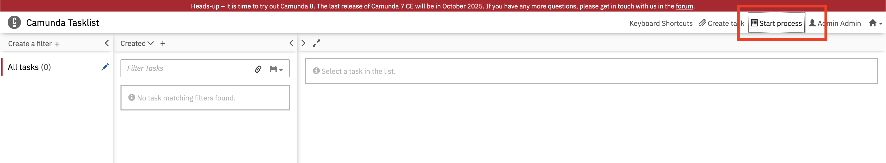
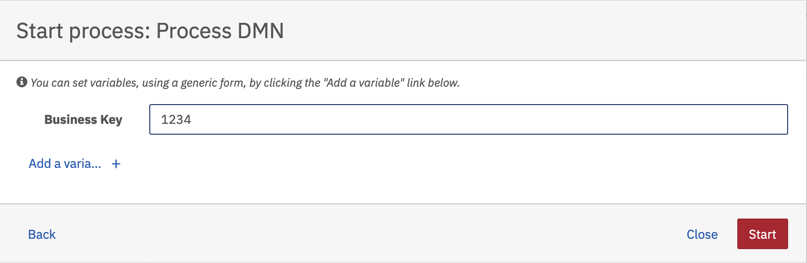
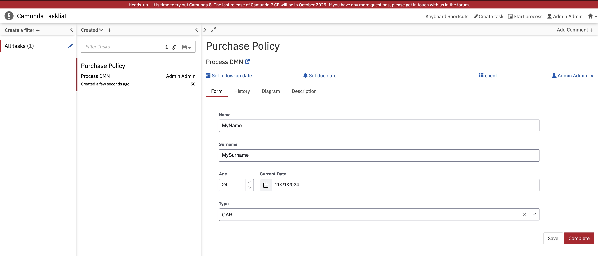
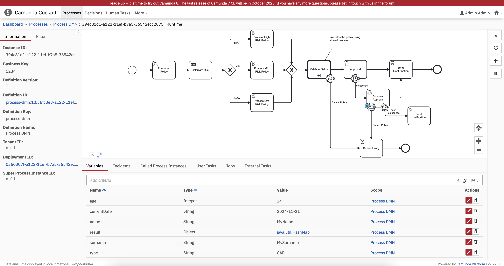
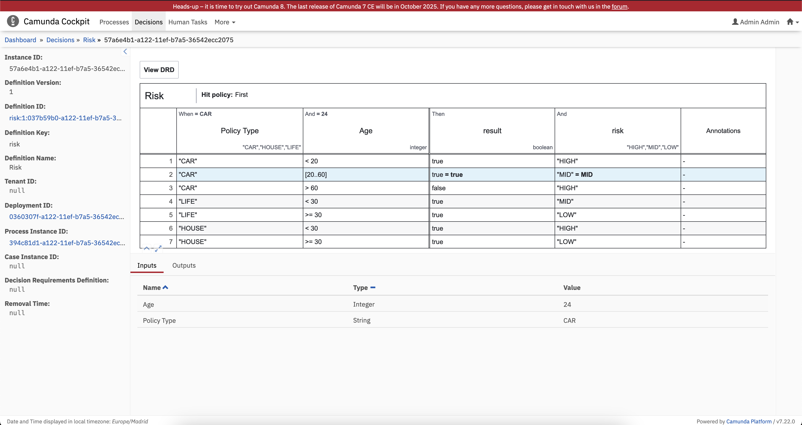
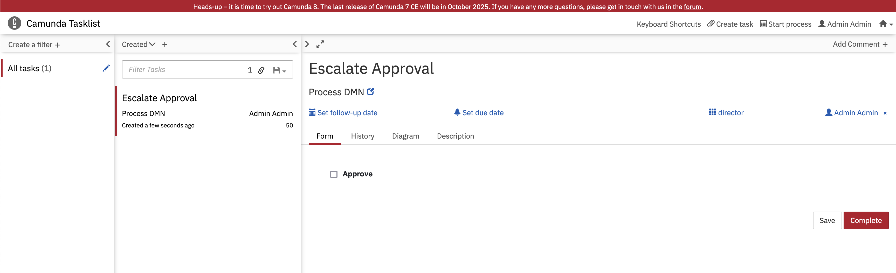

### Webapps

In order to run the **Process DMN**, you can go [Tasklist](http://localhost:8080/camunda/app/tasklist/default/) and **Start Process**. Then select the process to execute.



Then set the *Business Key* for the process instance to be created.

!!! note

    Business Key will be useful later to gather information about this instance and using other functionality such as **sending messages**. Instead of storing the internal identifier generated by Camunda (`UUID`) you can set a **external identifier**.



Refresh the page `F12` in order to get **all pending tasks**. Select the **Purchase Policy** task  and press **claim** to assign the task to yourself. Fill all the values and finally press **complete**.



Go to [Cockpit](http://localhost:8080/camunda/app/cockpit/default/) and select the **Process DMN** deployment and the current process instance to get process **information** and **insights**. From this **dashboard** you can get the **current state** of the process: watch all variables, current task and additional information.



Go to **Decisions**, then select the **Decision Table** used by this process (`Risk`) and select the **current process instance** being running. In this **dashboard** you can see the **decision made** by the **DMN** highlighted.



Finally, go to the Tasklist and complete the **Escalate Approval** task.



In **Camunda console** you must see following logs by using the **default values** in the forms. Different values will follow different paths in the flow that means different tasks and operations are performed.

```txt
Compute Policy MID risk
[result:true, risk:MID]
An email has been sent to the user to deny the policy.
```

### API Rest

#### Get All Process Definitions

Request

```bash
# Get all process definitions. You can filter processed by active, process key, etc..
curl --location 'http://localhost:8080/engine-rest/process-definition' \
--header 'Accept: application/json' \
| jq .
```

Response

```json
[
  {
    "id": "process-dmn:1:8b5fb8a9-a126-11ef-b98f-36542ecc2075",
    "key": "process-dmn", // (1)!
    "category": "http://bpmn.io/schema/bpmn",
    "description": null,
    "name": "Process DMN", // (2)!
    "version": 1, // (3)!
    "resource": "/Users/jsantosa/Projects/Github/Workflow-Engine-Example/src/workflow-engine/target/classes/workflows/examples/bpmn/process-dmn.bpmn",
    "deploymentId": "8b4ea1a0-a126-11ef-b98f-36542ecc2075",
    "diagram": null,
    "suspended": false,
    "tenantId": null,
    "versionTag": null,
    "historyTimeToLive": 180,
    "startableInTasklist": true
  },
  // more process definitions.
]
```

1. The **Process key** that will be used to create a **new Process instance**.
2. The **Name** of the process.
3. The latest **version** of the process deployed.

#### Start Process Instance

Request

```bash
# Start Process Instance. You can also send variables and other information to the process at start.
PROCESS_KEY=process-dmn
BUSINESS_KEY=1234
curl --location "http://localhost:8080/engine-rest/process-definition/key/$PROCESS_KEY/start" \
--header 'Content-Type: application/json' \
--header 'Accept: application/json' \
--data '{
  "businessKey": "'"$BUSINESS_KEY"'"
}' \
| jq .
```

Response

```json
{
  "links": [
    {
      "method": "GET",
      "href": "http://localhost:8080/engine-rest/process-instance/4031e4b2-a128-11ef-b98f-36542ecc2075",
      "rel": "self"
    }
  ],
  "id": "4031e4b2-a128-11ef-b98f-36542ecc2075", // (1)!
  "definitionId": "process-dmn:1:8b5fb8a9-a126-11ef-b98f-36542ecc2075",
  "businessKey": "1234", // (2)!
  "caseInstanceId": null,
  "ended": false,
  "suspended": false,
  "tenantId": null
}
```

1. The **internal identifier** generated for the current process instance.
2. The **external identifier** of the process.

#### Get All Tasks

Request

```bash
# Get all tasks. You can filter processed by candidate groups, candidate users, business key, etc..
curl --location 'http://localhost:8080/engine-rest/task?firstResult=0&maxResults=50' \
--header 'Content-Type: application/json' \
--header 'Accept: application/json' \
--data '{
  "active": "true"
}' \
| jq .
```

Response

```json
[
    {
        "id": "4033e085-a128-11ef-b98f-36542ecc2075", // (1)!
        "name": "Purchase Policy", // (2)!
        "assignee": null, // (3)!
        "created": "2024-11-12T19:59:31.968+0100",
        "due": null,
        "followUp": null,
        "lastUpdated": null,
        "delegationState": null,
        "description": null,
        "executionId": "4031e4b2-a128-11ef-b98f-36542ecc2075",
        "owner": null,
        "parentTaskId": null,
        "priority": 50,
        "processDefinitionId": "process-dmn:1:8b5fb8a9-a126-11ef-b98f-36542ecc2075",
        "processInstanceId": "4031e4b2-a128-11ef-b98f-36542ecc2075",
        "taskDefinitionKey": "purchase-policy", // (4)!
        "caseExecutionId": null,
        "caseInstanceId": null,
        "caseDefinitionId": null,
        "suspended": false,
        "formKey": null,
        "camundaFormRef": { // (5)!
            "key": "purchase-policy",
            "binding": "latest",
            "version": null
        },
        "tenantId": null,
        "taskState": "Created"
    }
]
```

1. The **internal identifier** of the task.
2. The **Name** of the task.
3. The current **assignee**.
4. The **task definition key** used in BPMN.
5. The **form** attached to this task.

#### Get All Users

Request

```bash
# Get all users. You can filter processed by firstName, email, emailLike, id, etc..
curl --location 'http://localhost:8080/engine-rest/user' \
--header 'Accept: application/json' \
| jq .
```

Response

```json
[
    {
        "id": "admin", // (1)!
        "firstName": "Admin",
        "lastName": "Admin",
        "email": "admin@localhost"
    }
]
```

1. **User identifier** to be used in operations such as **claim task**

#### Claim Task

Request

```bash
# Claim Task. You will need to know the task id and the user id.
TASK_ID=3f29c546-a137-11ef-b98f-36542ecc2075
USER_ID=admin
curl --location "http://localhost:8080/engine-rest/task/$TASK_ID/claim" \
--header 'Content-Type: application/json' \
--header 'Accept: application/json' \
--data '{
  "userId": "'"$USER_ID"'"
}' \
| jq .
```

Response

N/A

#### Get Task by Id (Approval Escalation)

Request

```bash
# Get task by id. You can filter processed by candidate groups, candidate users, business key, etc..
TASK_ID=3f29c546-a137-11ef-b98f-36542ecc2075
curl --location 'http://localhost:8080/engine-rest/task?firstResult=0&maxResults=50' \
--header 'Content-Type: application/json' \
--header 'Accept: application/json' \
--data '{
  "taskId": "'"$TASK_ID"'"
}' \
| jq .
```

Response

```json
[
  {
    "id": "4033e085-a128-11ef-b98f-36542ecc2075",
    "name": "Purchase Policy",
    "assignee": "admin", // (1)!
    "created": "2024-11-12T19:59:31.968+0100",
    "due": null,
    "followUp": null,
    "lastUpdated": "2024-11-12T21:10:26.298+0100",
    "delegationState": null,
    "description": null,
    "executionId": "4031e4b2-a128-11ef-b98f-36542ecc2075",
    "owner": null,
    "parentTaskId": null,
    "priority": 50,
    "processDefinitionId": "process-dmn:1:8b5fb8a9-a126-11ef-b98f-36542ecc2075",
    "processInstanceId": "4031e4b2-a128-11ef-b98f-36542ecc2075",
    "taskDefinitionKey": "purchase-policy",
    "caseExecutionId": null,
    "caseInstanceId": null,
    "caseDefinitionId": null,
    "suspended": false,
    "formKey": null,
    "camundaFormRef": {
      "key": "purchase-policy",
      "binding": "latest",
      "version": null
    },
    "tenantId": null,
    "taskState": "Updated"
  }
]
```

1. the task has been assigned to `admin` user.

#### Submit Form (Purchase Policy)

Request

```bash
# Submit form
TASK_ID=c3ae18d3-a135-11ef-b98f-36542ecc2075
curl --location "http://localhost:8080/engine-rest/task/$TASK_ID/submit-form" \
--header 'Content-Type: application/json' \
--header 'Accept: application/json' \
--data '{
  "variables": {
    "name": {
      "value": "MyName"
    },
    "surname": {
      "value": "MySurname"
    },
    "age": {
      "value": 24
    },
    "currentDate": {
      "value": "2024-11-20"
    },
    "type": {
      "value": "CAR"
    }
  }
}' \
| jq .
```

Response

N/A

#### Get All Tasks

Request

```bash
# Get all tasks. You can filter processed by candidate groups, candidate users, business key, etc..
curl --location 'http://localhost:8080/engine-rest/task?firstResult=0&maxResults=50' \
--header 'Content-Type: application/json' \
--header 'Accept: application/json' \
--data '{
  "active": "true"
}' \
| jq .
```

#### Claim Task (Approval Escalation)

Request

```bash
# Claim Task. You will need to know the task id and the user id.
TASK_ID=081da124-a136-11ef-b98f-36542ecc2075
USER_ID=admin
curl --location "http://localhost:8080/engine-rest/task/$TASK_ID/claim" \
--header 'Content-Type: application/json' \
--header 'Accept: application/json' \
--data '{
  "userId": "'"$USER_ID"'"
}' \
| jq .
```

#### Submit Form (Approval Escalation)

Request

```bash
# Submit form
TASK_ID=081da124-a136-11ef-b98f-36542ecc2075
curl --location "http://localhost:8080/engine-rest/task/$TASK_ID/submit-form" \
--header 'Content-Type: application/json' \
--header 'Accept: application/json' \
--data '{
  "variables": {
    "approved": {
      "value": false
    }
  }
}' \
| jq .
```
